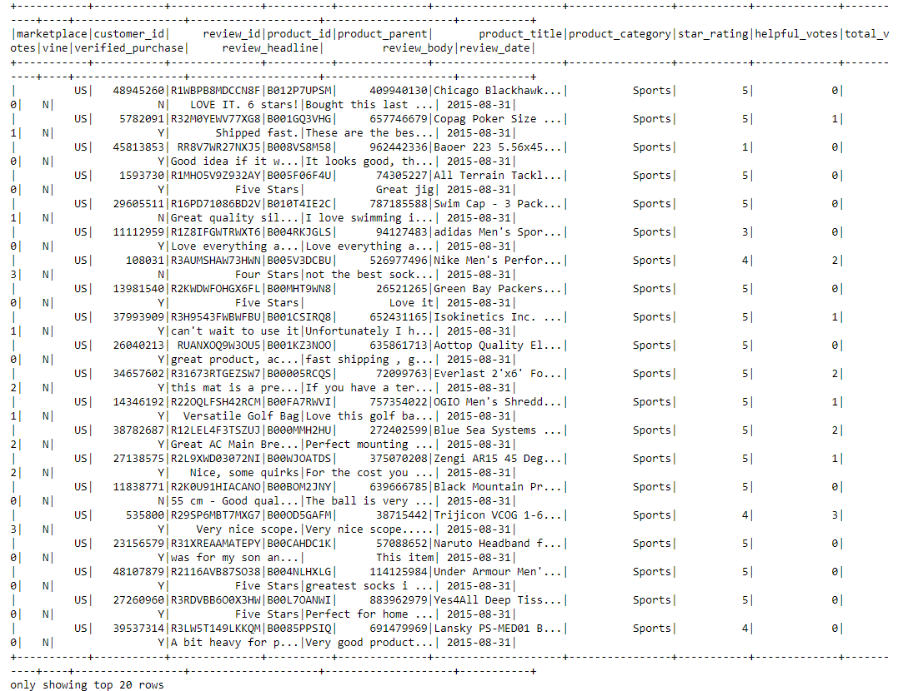
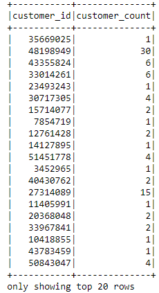
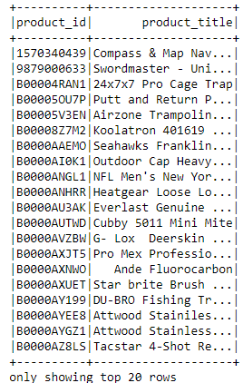
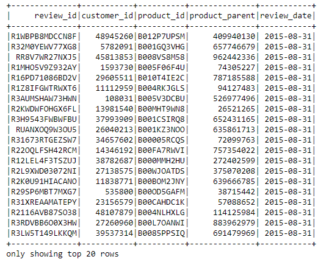
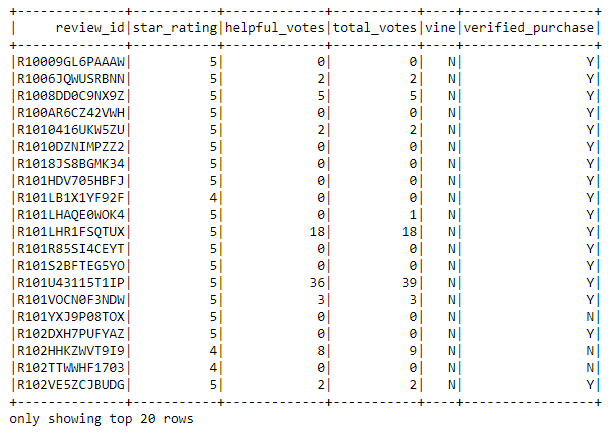

# Amazon_Vine_Analysis

## Overview of Analysis:

We have been asked to analyze Amazon reviews written by members of the paid Amazon Vine program.  We have chosen a random dataset (sports) and used PySpark to perform the ETL process to extract the dataset, transform the data, connect to an AWS RDS instance, and load the transformed data into pgAdmin. Next we used PySpark to determine if there was any bias toward favorable reviews from Vine members in the dataset. The analysis is for SellBy stakeholders

## Resources:

Software:  
Google Colab 
PySpark version 3.0.3 
pgAdmin4 version 5.2 
PostgreSQL version 12.7 
 
Code:  
[Amazon_Reviews_ETL.ipynb](Amazon_Reviews_ETL.ipynb) 
[Vine_Review_Analysis.ipynb](Vine_Review_Analysis.ipynb) 

Images: 
[Images](Images/)  

Data: 
https://s3.amazonaws.com/amazon-reviews-pds/tsv/amazon_reviews_us_Sports_v1_00.tsv.gz  

## Amazon Reviews Dataset:

We extracted the Amazon Review Dataset and created a DataFrame.  That DataFrame was transformed into four new DataFrames and loaded into tables in pgAdmin.

Initial DataFrame  
  

Customer DataFrame  
  

Products DataFrame  
  

Review ID DataFrame  
  

Vine DataFrame  
  

## Determine Bias of Vine Reviews 

## Results of VIne Reviews

- 61948 total amount of combined reviews 

- 32804 total amount of 5 Star Reviews 

- 139 total amount of 5 Star Vine Reviews 

- 32665 total amount of 5 Star non-Vine Reviews 

- 0.42 percentage of 5 Star Vine Reviews 

- 99.58 percentage of 5 Star non-Vine Reviews 

## Summary

